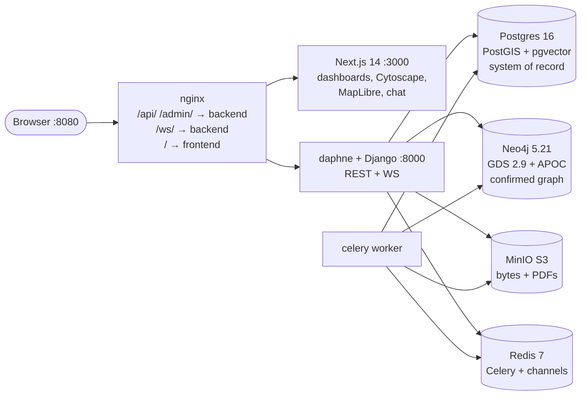
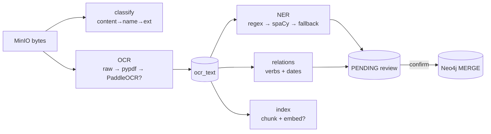

# PRAMAAN — Master Documentation

*AI-powered criminal network analysis: fragmented investigation data in,
evidence-backed temporal knowledge graph out. Written from the actual
codebase — anything not fully wired is flagged ⚠️ **Stub**.*

---

## 1. What This System Does

A criminal investigation produces a mess: scanned FIRs (First Information
Reports — the document that opens a police case in India), CDRs (Call
Detail Records — who-called-whom phone logs), bank statements, witness
notes, photos. Today an investigator holds the connections between these
fragments in their head. PRAMAAN holds them in a graph — and, crucially,
shows its work: every link between two people carries **why** (the source
document and exact sentence), **when** (dates parsed from the text),
**how strongly** (a confidence score), and **by what method** (regex,
spaCy, human confirmation).

Two roles use it. The **SHO** (Station House Officer — the supervisor) owns
cases, assigns investigators with view/edit/admin rights, approves risky AI
suggestions like merging two identities, and reads the immutable audit log.
The **investigator** uploads evidence, reviews what the AI extracted
(confirm/reject in a queue — nothing reaches the graph unconfirmed),
explores the network, asks a copilot questions in plain language, and
exports a court-ready PDF package with hashes and custody trails.

The pipeline, in one breath: upload → SHA-256 hash + MinIO storage →
Celery stages (classify → OCR → entity/relation extraction → dedupe
suggestions → search indexing) → human review → confirmed rows MERGEd into
Neo4j → Cytoscape explorer, GDS analytics, RAG copilot, PDF exports, live
alerts over WebSocket.

---

## 2. High-Level Architecture



Two Python processes share everything: **backend (daphne)** serves HTTP
plus the `ws/alerts/` socket (Django's `runserver` cannot do WebSockets —
that's the entire reason the container runs daphne), and **worker
(celery)** runs the AI pipeline off-request. Redis doubles as Celery
broker and Channels layer, which is what lets a worker-side event reach a
browser socket in another process.

End to end, an upload travels: `POST /api/cases/{id}/evidence/` →
hash + uuid key + MinIO put + custody row → `process_evidence.delay()` →
ingest-verify → classify → OCR → NER → relations → merge suggestions →
chunk/index → PENDING rows in Postgres → investigator confirms → `build`
MERGEd into Neo4j with `source_evidence_id`, confidence, engine, dates →
explorer, analytics, copilot, alerts, PDF. Details:
[architecture/overview](architecture/overview.md) ·
[architecture/ai-pipeline](architecture/ai-pipeline.md).

---

## 3. Infrastructure — Container by Container

All eight services live in `docker-compose.yml`; `docker compose up
--build` is the whole deploy. Host ports that differ from container ports
exist because developer machines often already run Postgres/Redis:
Postgres `5433:5432`, Redis `6380:6379` (containers still use
`db:5432`/`redis:6379` internally — host-side commands must use the
remapped ports).

| Service | What it is / Dockerfile in plain English | Talks to | Persists in |
|---|---|---|---|
| `db` | Built from `postgis/postgis:16-3.4`; installs three **vendored** `.debs` (libllvm16 → postgres-16 upgrade → pgvector 0.8.6) offline with `dpkg` — a 41 MB apt chain kept failing on slow links, so no network at build time | backend, worker | `pgdata` |
| `neo4j` | Stock `neo4j:5.21-community` + `APOC`/`graph-data-science` plugins (measured live: GDS 2.9.0, APOC 5.21.2) | backend, worker | `neo4jdata`, `neo4jlogs` |
| `redis` | Stock `redis:7-alpine` | backend, worker | `redisdata` |
| `minio` | Pinned `RELEASE.2024-06-06`, bucket `evidence` | backend | `miniodata` |
| `backend` | `python:3.12-slim` + build tools + Postgres libs → pip install → spaCy model download (~1.4 GB image); runs migrate → seed → **daphne** | db, neo4j, redis, minio | code bind-mounted |
| `worker` | Same image, `celery -A config worker` | db, neo4j, redis, minio | — |
| `frontend` | `node:20-alpine` → `npm install` → serves **`npm run dev`** (⚠️ demo-grade dev server, not `next start`) | backend via nginx | source dirs mounted (never `/app` itself — a stale anonymous `node_modules` volume once shadowed a dependency update and 500'd the UI) |
| `nginx` | `nginx:1.27-alpine` on `:8080`; hardening headers; 100 MB uploads; **no static `upstream` blocks** — Docker-DNS resolution per request, after stale IPs caused real 502s on container recreate | everything | config file mount |

Healthchecks gate startup (backend waits for `pg_isready`). Full detail:
[architecture/infra](architecture/infra.md) · variables:
[setup/environment-variables](setup/environment-variables.md).

---

## 4. Backend — Django, App by App

Django 4.2 + DRF, JWT-only auth (SimpleJWT: access 30 min, refresh 1 day),
global `IsAuthenticated`, page size 20. RBAC lives in one module
(`apps/cases/permissions.py`): `user_can_view_case` (SHO all; else owner
or assignee), `user_can_edit_case` (SHO/owner/edit-admin assignment),
`visible_case_ids()` (`None` = SHO), `IsSHO`. Enforcement = queryset
filtering + per-object checks + a middleware audit trail.

**accounts** — `User(AbstractUser)` + `role` (sho/investigator/admin),
`phone`, `totp_secret`, `totp_enabled`. Endpoints: `login/` (returns a
5-minute `purpose:"2fa"` pre-token instead of tokens when 2FA is on),
`login/2fa/`, `refresh/`, `me/`, SHO-only `register/` + `users/`, and
`2fa/setup|verify|disable|status`. TOTP is stdlib-only RFC 6238 (±1 step
skew).

**cases** — the authorization boundary. `Case` (unique `fir_no`, title,
status open/under_investigation/pending_review/closed/archived,
free-text `risk_level`, station, district, PROTECT owner);
`CaseAssignment` (unique pair, view/edit/admin); `CaseTask`
(todo/doing/done, assignee must see the case), `CaseComment`
(author-or-SHO delete), `CaseLink` (unique pair, no self/reverse dups).
Endpoints: CRUD (delete SHO-only), SHO-only `assign/`, SHO-only `close/`
(⚠️ just flips status — no archival flow despite the docstring),
`tasks|comments|links|activity/` (activity merges path-filtered audit rows
with tasks + comments).

**evidence** — `Evidence` (file meta, indexed `sha256`, uuid MinIO key,
classification + confidence, OCR status/text/pages/engine,
`processing_error`; index on case+date); `ChainOfCustody` (**SET_NULL** —
trails survive file deletion; 7 action types); `DocumentChunk`
(case-denormalized, 768-d vector, unique per evidence+index). Upload =
multipart → bytes → inline MinIO put (store-down degrades to recorded
error, bytes deferred to `/reprocess/`) → row → custody entry → Celery
chain → 201. Detail views log VIEWED, downloads return 1-hour presigned
URLs and log DOWNLOADED. Tasks: ingest-verify, classify, OCR, index,
and the `process_evidence` orchestrator (stages never raise).

**graph_api** — Postgres review queue + the sole Neo4j gateway.
`ExtractedEntity` (unique per case+type+normalized; confidence, engine,
pending/confirmed/rejected/merged, `mention_count`, `merged_into`,
`graph_key`, lat/lng + source), `ExtractedRelation` (unique per
case+src+dst+type; confidence, evidence `snippet`, nullable `valid_from`),
`MergeSuggestion` (ordered pair, score, reason, SHO-approved),
`GraphSnapshot` (frozen nodes/edges + filters). Review lists + decide
endpoints (relation-confirm ≥0.60 fires a CONNECTION alert), SHO-gated
merge approval with relation repointing + APOC node fold, case-nested
graph/expand/build/timeline/snapshots/geo routes.

**analytics** — `RiskReport` (case, author, pinned `weights_version`,
full factor JSON — every score reproducible). Endpoints: GDS overview
(top-15 players, bridges, communities, engine + notes), risk (auto-saves
a report), risk history, anomalies, date-compare, cross-case (≥2
mutually-visible cases only), districts + district aggregates.

**copilot** — `POST query/ {question ≤1000 chars, case_id?}`. Regex intent
router (no LLM): *path* → Neo4j `shortestPath` (≤4 hops) verbalized with
per-hop evidence (unconfirmed names get a "confirm first" answer, never a
guess); *summary* → GDS + risk rollup; *generic* → hybrid retrieval
(pgvector cosine, then full-text to fill top-6) → Gemini-grounded answer
with cite-or-decline instructions, or a labeled extractive answer without
a key. Case scoping precedes every lookup.

**search** — `GET /api/search/?q=&type=&case_id=&limit=` (q ≥2 chars,
limit 1–50): grouped entities/evidence/cases; trigram similarity (>0.15)
plus full-text rank on Postgres, icontains elsewhere; case filter must be
visible.

**system** — unauthenticated `GET /api/health/` with per-dependency
ok/ms/detail (503 if anything down).

**alerts** — deduped case `Alert`s (24 h window) → per-user
`Notification`s via `AlertRule`s (kind/severity/confidence/case, email
digest flag) → WebSocket push to `user_{id}` groups (JWT query auth,
close 4401). Emitted on high-confidence confirms, post-build anomaly/risk
checks, and cross-case matches (delivery requires seeing *all* involved
cases). Endpoints: scoped feed, notifications (+read/read-all), personal
rules CRUD; `send_digest` composes mocked digests (⚠️ no real SMTP).

**reports** — `Report` rows + reportlab PDF builder (cover, manifest with
truncated hashes, per-file custody ledger, confirmed findings, full hash
manifest). `POST case-package/` (edit-gated) builds sync, stores under
`reports/case_{id}/`, returns a 7-day presigned URL; download streams it.

**auditlog** — `AuditLog` rows (actor, action, **request path** as
object_type, response status, IP) written by middleware for every
mutating `/api/` call except `/api/audit/` itself; list is SHO-only,
read-only. Honesty note: `object_id` is always `""` and `before` always
`{}` — coarser than "before/after state" suggests.

Full endpoint table: [api/endpoints](api/endpoints.md). Models:
[data-model/postgres-schema](data-model/postgres-schema.md).

## 5. AI Pipeline — Stage by Stage

One Celery task per stage, typed in/out contracts, none ever raising —
failures land on `Evidence.processing_error` for `/reprocess/`.



**Ingest & classify.** `ingest_evidence` re-verifies the MinIO object.
`classify_file` runs pure heuristics — content markers first (CDR/bank/
FIR/witness keyword sets, 0.85–0.90), then filename keywords (0.75–0.80),
then extension/MIME (photo 0.90, audio transcript 0.85, spreadsheet 0.55,
PDF 0.50), else `other` 0.30. A learned classifier can replace one
function behind its `{label, confidence, reason}` contract.

**OCR** (`ocr.py`, cheapest first): raw-text decode (1.0) → pypdf text
layer (0.95, needs ≥50 chars) → **PaddleOCR** (0.80, lazy import —
⚠️ implemented but **inactive in the base image**; scanned uploads record
`unavailable`, never fail) → audio/odd types `skipped`.

**NER** (`extract.py`): deterministic regex owns phones (+91/10-digit,
0.95) and Indian plates (0.90) — spans the model can never steal. spaCy
`en_core_web_sm` (baked into the image; absent → regex-only warning)
finds PERSON/ORG/LOC, with small-model noise suppressed on purpose
(DATE-tagged phones ignored, single-token names folded into known full
names, ALL-CAPS tokens like UTR dropped). A capitalized-name fallback
(0.50) catches Indian names the English model misses in noisy contexts.
⚠️ The documented `transformers`/IndicBERT third layer (`extract_hf()`)
**does not exist**, and `transliterate()` (IndicXlit, e.g. राहुल पाटील ↔
Rahul Patil) is a placeholder raising ImportError — regional-language
NER is a documented hook, not a code path. Normalization (shared by
extraction, resolution, and Neo4j keys): phones → last 10 digits,
plates → upper alnum, names → lowercased minus titles.

**Relations**: sentence-level co-occurrence with verb typing and
deterministic textual-order direction — call-verbs → `CALLED` (.60/.55),
money-verbs + amounts → `TRANSFERRED_MONEY_TO` (.60/.55, org payers
allowed), meet-verbs → `ASSOCIATED_WITH` (.55), own-verbs →
`OWNS` (.60), work-verbs → `EMPLOYED_BY` (.55), any person+location →
`PRESENT_AT` (.50), bare co-occurrence → `ASSOCIATED_WITH` (.45).
Aliases resolve only through unambiguous tokens ("Sharma" inside "Sharma
Transports" is correctly *not* Rahul). `parse_dates` anchors each edge to
its sentence's first explicit date (`valid_from`); undated stays NULL and
always passes date filters.

**Resolution** (`resolve.py`): phone/plate identical → 1.0; person exact
→ 0.95, initial+surname ("R. Sharma") → 0.80, fuzzy ≥0.75; place/org
exact → 0.90, fuzzy ≥0.85. Persons block on (surname, first-initial) so
variants meet; suggestions fire at 0.75 — and **even 1.0 phone anchors
require human confirmation** (auto-merge is reserved, never enabled).

**Indexing**: sentence-aware ~800-char chunks (~100 overlap); Gemini
`text-embedding-004` (768d) in batches of 16, per-item `None` on failure;
no key → embedding-free chunks for keyword retrieval. `reindex --all/--fir`
rebuilds idempotently.

**GDS analytics** (per-case projection, dropped in `finally`): degree
(undirected), confidence-weighted PageRank, directed betweenness (GDS 2.x
rejects `orientation` there), WCC + Louvain; bridges = multi-community
links + shortest-path brokers; failing algorithms omit with notes. Risk =
pinned v1 (centrality .30, brokerage .25, connectivity .20, cross-case
.15, evidence .10; high ≥.60, medium ≥.35), every run persisted.
Anomalies are plain statistics (hub z>2 with n≥4; ≥3 same-date edges;
community mean confidence <.5) — sklearn/torch are named swap-ins, not
installed.

**Gemini RAG**: `google-genai` SDK (the old `google-generativeai` package
is deprecated), generation default `gemini-2.0-flash`, top-6 hybrid
retrieval (vector, then full-text fill; icontains fallback off-Postgres).
RAG instead of a chatbot because the corpus is case-scoped per query and
every claim must cite numbered excerpts — the prompt instructs
cite-or-decline, and keyless mode answers extractively, labeled
`generated: false`.

---

## 6. Frontend — Next.js, Page by Page

Next.js 14 App Router + React 18 + TypeScript + Tailwind. No store, no
query library: `lib/api.ts` (~70 `fetch` helpers; Bearer header split for
multipart/blob calls; errors thrown as `API {status}` and rendered
inline per panel) + `useState`/`useEffect` per component. Tokens, theme,
and language persist in `localStorage`; **token refresh is not
automated** (expiry surfaces as errors until re-login — known gap).

| Route | What happens there |
|---|---|
| `/` | Redirect to dashboard |
| `/login` | Password step; 2FA code step appears iff the API returns `two_factor_required` |
| `/dashboard` | Session header, 3 stat cards, cross-case flags, district overview, 2FA security card, case list |
| `/cases` | Read-only list (⚠️ create/assign/close exist only in the API/admin) |
| `/cases/[id]` | The workbench (below) |
| `/search` | Grouped entity/evidence/case results, typo-tolerant |
| `/alerts` | Feed / my notifications / routing rules / mock digests |

The case workbench renders: filter toolbar (type toggles, confidence
slider, date range, debounced) → Cytoscape canvas (cose, type-colored
nodes, labeled arrows) + **Why? panel** (label, confidence, validity
date, extraction timestamp/engine, snippet, source doc with hash and
uploader; node selections get an Expand control, 1–3 degrees merged live)
→ snapshots (save/load/A-vs-B diff) + date-compare + chronological
timeline → analytics (factor tooltips, **risk overlay** painting node
borders red/amber/green, recompute) → **replay slider** (edges emerge at
their `valid_from`; undated toggle; exit restores) → copilot chat
(suggested questions, cited turns marked generated vs evidence-backed) →
geo map (Carto dark tiles, hotspots, per-person movement lines) + reports
(generate/download PDF) → review queue (5 s polling while pending) →
evidence intake (drag-drop, classification/OCR status, custody, outbox
retry) → workflow tabs (tasks/comments/links/activity).

Cross-cutting UI: header nav (translated) + language/theme toggles +
**alerts bell** (unread badge, dropdown, live WS toasts, 60 s poll
fallback); offline banner; skeleton loaders; empty states instead of
crashes. ⚠️ No service worker (manifest-only PWA); ⚠️ comment-delete,
geo-nearby, and manual-locate have API but no buttons.

---

## 7. Data Model

**Postgres** (19 migrations; `app_label_model` tables): users (+TOTP
fields); cases (+assignments, tasks, comments, links); evidence (+custody
SET_NULL ledger, 768-d chunks); review queue (entities unique per
case+type+normalized with mention counts and merge links; relations with
snippets + nullable dates; scored merge suggestions; frozen snapshots);
risk reports (full factor JSON); alerts + per-user rules + notifications;
report rows; audit rows; hot-filter composite indexes on review status,
bell queries, feeds, and timestamps. Table-by-table:
[data-model/postgres-schema](data-model/postgres-schema.md).

**Neo4j** (confirmed-only): `:Case` + type-labeled nodes keyed
`{case}:{Type}:{normalized}`; every node/edge carries value, confidence,
`source_evidence_id`, engine, timestamp, validity dates. Edge types:
CALLED, TRANSFERRED_MONEY_TO, ASSOCIATED_WITH, PRESENT_AT, OWNS,
EMPLOYED_BY, RELATED_TO (+ declared-but-unused MET_AT/Event/valid_to —
see stubs). [data-model/neo4j-schema](data-model/neo4j-schema.md).

**Why two databases**: Postgres owns identity, permissions, review state
machines, trigram/full-text/vector search, and audit — all relational.
Neo4j owns multi-hop traversal, centrality, communities, and shortest-path
QA — all graph-native. `graph_key` is the join; Postgres is the system of
record, Neo4j the derived confirmed view.

## 8. Security Model

**RBAC, in code**: one module (`cases/permissions.py`) exports `IsSHO`,
`user_can_view_case`, `user_can_edit_case`, `visible_case_ids()`.
Enforcement is threefold — queryset scoping (SHO sees all; others
owned∪assigned; feeds/search/reports/cross-case filter the same way),
per-object checks on every detail/write path (delete-case and
merge-approve are SHO-only, both test-proven 403s), and the audit
middleware. Cross-case paths are strict: discovery needs ≥2
mutually-visible cases, alert delivery needs visibility of *all*
involved cases — hidden cases never leak, not even as counts.

**2FA, step by step**: authed `2fa/setup/` issues a base32 secret +
`otpauth_url` (enabled stays false) → `2fa/verify/` checks the 6-digit
code (stdlib RFC 6238, ±1 step) → enabled → `login/` returns
`{two_factor_required, pre_token}` (5-min `purpose:"2fa"` JWT) instead of
tokens → `login/2fa/` exchanges pre-token + fresh code for the real pair
(401 on either failure) → `2fa/disable/` needs the password. The login
page grows the code step automatically; the dashboard security card
manages lifecycle; seed keeps demo users 2FA-free.

**Evidence integrity**: SHA-256 at upload, uuid namespaced MinIO keys,
1-hour presigned downloads (7-day for reports), append-only custody
ledger whose rows survive file deletion, PDFs embedding the full hash
manifest for out-of-band verification.

**Encryption**: Bearer JWTs in transit; nginx hardening headers; TLS
terminates upstream in production. At rest: ⚠️ **no field is encrypted
today** — `apps/security.py` (Fernet AES) and `FIELD_ENCRYPTION_KEY`
exist but nothing imports them. That is the top security follow-up.
⚠️ **No hardware TEE** (SGX/TrustZone) by decision: the threat model is
credential and custody integrity, for which RBAC + hashes + audit (+
software AES once wired) are proportionate; a TEE would add attestation
ops with no matching attacker in scope.

---

## 9. Experience Layer

**Theming**: CSS-variable tokens with a dark default and a light block
that remaps the shared dark utilities, so one toggle flips the app.
Persisted (`pramaan_theme`), applied pre-paint by an inline head script
(no flash). **i18n**: `LangProvider` + `t(key, fallback)` — Hindi covers
~52 keys across header/login/dashboard/case surfaces (~20 call sites);
anything unkeyed renders the English fallback, so coverage is progressive
and never blank. Data (names, FIRs, snippets) is never translated.
**Responsive/PWA**: wrapping header, stacking grids, shorter canvases on
mobile, safe dropdowns, `device-width` viewport; installable via manifest
+ SVG icons (no service worker); offline banner plus an IndexedDB
evidence outbox (bytes stashed on network failure, Retry replays). Full
honesty on gaps: [i18n](features/i18n-and-accessibility.md) ·
[offline](features/offline-and-pwa.md).

---

## 10. Testing & Verification

99 tests, 9 files, all passing last full run (`python manage.py test`
with Postgres + `CELERY_EAGER=1`): 2FA vectors + full TOTP flow (3);
rules/dedupe/strict delivery/hooks/WS channel (7); risk math + anomaly
rules + mocked-GDS mapping/bridges/failure-notes + endpoint wiring +
scoping (13); PDF shape + district aggregates + workflow permissions (8);
chunking/intents/mocked-Gemini indexing/copilot intents+scoping/search +
trigram typo (17); classifier/OCR/pipeline/custody/outage/RBAC (14);
normalization/extraction/resolution/idempotency/Cypher shape/merge/review
(19); dates/filters/expand/timeline/snapshots (11); geo math + endpoints +
locate (7). Conventions: real-JWT logins, DB-state assertions, outsider
paths asserted almost everywhere, heavy deps mocked at module
boundaries, spaCy tests skip cleanly without the model, channel tests use
the in-memory layer. No frontend test runner — UI verification is
`tsc --noEmit` + `next build` + live walkthroughs.

Measured live (last verification, warmed stack): login ~240 ms, `/me` 22
ms, cases 67 ms, search 86 ms, health 171 ms end-to-end (db 11.6 / redis
67 / neo4j 537 / minio 1085 ms, cold connects); Neo4j GDS 2.9.0 / APOC
5.21.2, pgvector 0.8.6 / pg_trgm 1.6 / PostGIS 3.4.3. API budget (<500 ms
standard queries) holds on demo data; GDS/heavy endpoints are the known
scaling edge (per-case projections, 500–5000 caps).

---

## 11. Key Engineering Decisions & Trade-offs

MinIO over cloud S3 (zero-dependency demo, `storage.py` is the only file
that knows); Neo4j + Postgres split by workload with `graph_key` as the
join; spaCy-small + regex + fallback in-image, transformers/torch/Paddle
behind lazy imports and honest `unavailable`s; Gemini over local LLM (no
GPU; key-optional degradation); GDS + APOC for real analytics and merges;
daphne because runserver can't do WebSockets; Redis for both Celery and
Channels; Cytoscape + keyless Carto tiles, hand-rolled chart bars;
vendored pgvector debs for network-proof builds; dev-server frontend and
bind mounts for iteration speed; no TEE (threat-model fit) with the
explicit IOU that field encryption is still unwired.

**Lessons learned (demo-Q&A gold)**:
1. *Stale nginx upstreams*: static `upstream` blocks cached container IPs
   across recreates → instant 502s. Fix: Docker-DNS resolution per request
   (`resolver 127.0.0.11` + variable `proxy_pass`).
2. *Stale anonymous volumes*: overlaying `/app` hid the image's fresh
   `node_modules` behind an old volume → UI 500 after adding a dependency.
   Fix: mount source dirs only.
3. *APOC combine-mode merges*: conflicting scalars became lists and
   crashed graph reads (`unhashable type: 'list'`). Fix: explicit scalar
   SET after merge + defensive first-element reads.
4. *Port squatting*: a local Postgres/Redis beats Docker's mappings —
   hence `:5433`/`:6380` and the env overrides in the setup guide.
5. *Duplicate view method*: `GraphViewSet` defines `timeline` twice; the
   unguarded copy wins (500 instead of graceful fallback if Neo4j is
   down) — still in the code, flagged for a cleanup pass.

---

## 12. How to Run It Locally

```powershell
Copy-Item .env.example .env
docker compose up --build
# open http://localhost:8080 — login sho_demo / Pramaan123!
# tour: FIR-2026-1000 graph → another case's review queue → confirm →
# rebuild → copilot: "How is Rahul Sharma connected to Vikram Patil?"
```

Host-side dev needs `DATABASE_URL=…@localhost:5433/…` and
`REDIS_URL=…localhost:6380/0` (+ `CELERY_EAGER=1` to skip the worker);
`python manage.py seed_demo --cases 6` re-runs idempotently; `reindex
--all` rebuilds search chunks; without `GEMINI_API_KEY` the RAG legs run
keyword-only. Full steps + gotchas:
[setup/local-dev](setup/local-dev.md).

---

## 13. What's Left / Roadmap

**Fully built**: auth + 2FA + RBAC, case CRUD/assign/close, evidence
pipeline (classify/OCR/index) with custody, NER + relations + resolution
+ review queue + SHO merges, live Neo4j graph with filters/expand/
snapshots/timeline/replay, GDS analytics + explainable risk + anomalies,
cross-case discovery, RAG copilot (3 intents) + global search, realtime
alerts + rules + mocked digests, geo points/movements/nearby/hotspots,
PDF evidence packages, district analytics, tasks/comments/links/activity,
audit trail, themes, EN/हिं chrome, PWA manifest + upload outbox, health
checks.

**Stubbed or partial (honest list)**: what-if simulation (`not-computed`,
unrouted); `Event` nodes / `MET_AT` edges / `valid_to` (schema without
producers); IndicBERT NER + IndicXlit transliteration (hooks only);
PaddleOCR inactive without the ML stack; field-level AES (helpers
unwired); real SMTP digests; comment-delete / geo-nearby / manual-locate
/ case create-assign-close **UI** (APIs exist); service worker; automated
token refresh; full a11y audit; `SENTRY_DSN` read by nothing; schema
version string still says "Phase 1".

**Beyond**: wire field encryption for PII; install the ML stack for
scanned OCR + regional NER; sklearn/IsolationForest anomaly options;
PostGIS-native geo at scale; `next start` production frontend; load test
toward ~100 concurrent users; backup/retention jobs.

---

## 14. Assumptions & Open Questions (for the repo owner)

1. `MET_AT`, `Event`, `valid_to` look reserved for a temporal-meeting
   model that was never specified — confirm they can stay dormant, or
   define the intended semantics.
2. `Case.risk_level` is free text while GDS computes risk separately; no
   code syncs them. Intended, or should builds write it back?
3. `AuditLog.object_id`/`before` are always empty — is path+status enough
   for your chain-of-custody needs, or should object snapshots be added?
4. No UI exists for case create/assign (SHO flows) — assumed
   admin/API-acceptable for now; flag if judges will click it.
5. `SENTRY_DSN` and `FIELD_ENCRYPTION_KEY` are read by nothing/nearly
   nothing — keep the names or drop them from `.env.example`?
6. Duplicate `timeline` definition in `GraphViewSet` (unguarded copy
   wins) — safe to delete the second copy?
7. `apps/admin_register.py` (dead, 414 bytes) — safe to delete?
8. Test count cited (99) is from the last full run with no code changes
   since; re-run `python manage.py test` if any file moved.


