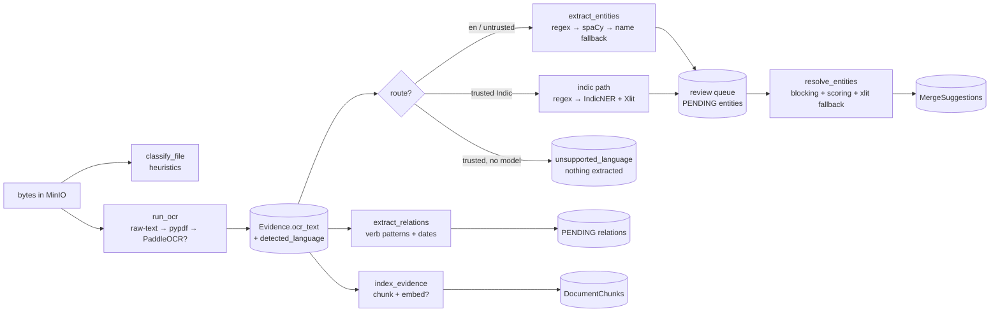

# AI Pipeline — Stage by Stage

One Celery task per stage, each with a typed in/out contract, each
**never raising** (failures land on `Evidence.processing_error`). The
orchestrator `process_evidence` runs them in order: ingest → classify →
OCR → NER → relations → resolve → index. Trigger: upload view
(`process_evidence.delay`) or `reprocess/`; worker: `celery -A config worker`.

## 1. `ingest_evidence` — verify the bytes

Input: evidence id. Re-checks the MinIO object exists (`head_object`).
Output: `{storage_key, sha256, status}`. The actual upload already happened
inline in the view; a missing object just records an error for `/reprocess/`.

## 2. `classify_file` — what kind of document is this?

Pure heuristics in `evidence/services/classifier.py` (`classify(filename,
mime, text_sample)`), first match wins: **content markers** (CDR/bank/FIR/
witness keyword sets, 0.85–0.90) → **filename keywords** (`fir`, `cdr`,
`tower dump`, `witness`, `bank`…, 0.75–0.80) → **extension/MIME**
(image→photo 0.90, audio→transcript 0.85, spreadsheet→cdr 0.55, pdf→document
0.50) → `other` 0.30. The text sample comes from `ocr.sample_text` (never
runs OCR — PDFs via pypdf head, text files directly). Result + confidence
stored on the row; `ChainOfCustody.CLASSIFIED` logged. A learned classifier
can replace `classify()` behind its `{label, confidence, reason}` contract.

## 3. `run_ocr` — bytes to text

`evidence/services/ocr.py`, cheapest engine first (`extract_text` returns
`{text, pages, engine, confidence, status}`):

1. `raw-text` (confidence 1.0): txt/csv/log decoded directly.
2. `pypdf-text` (0.95): PDFs with an embedded text layer (≥50 chars).
3. `paddleocr` (0.80): scanned PDFs/images — **lazy import**; without the
   `requirements-ml.txt` stack it returns `status: "unavailable"` instead of
   failing (⚠️ implemented but **inactive in the base image** — scanned
   uploads index nothing until PaddleOCR is installed).
4. Anything else (audio etc.): `skipped`. Exceptions: `failed` with the
   error recorded — never raised.

## 4. `extract_entities` — NER (multilingual)

`run_ocr` persists `detected_language` (+ confidence) on the evidence row
the moment text is obtained; the NER task re-detects for routing and
backfills old rows. `language.py` owns detection/routing, `indic_extract.py`
owns the Indic path, `extract.extract_for_evidence()` is the single router:

- **English path** (English, untrusted/short/empty, or trusted non-Indic on
  Latin script): `extract_entities`, frozen behavior —
  - **Regex** (deterministic, Indian-context): `+91`/10-digit phones 0.95,
    Indian plates (`MH12AB1234` shapes) 0.90.
  - **spaCy** `en_core_web_sm` (downloaded in the backend Dockerfile; absent →
    regex-only mode with a warning): PERSON 0.75 (multi-token) / 0.55
    (single-token), ORG 0.65, GPE/LOC/FAC 0.65. Small-model noise is
    suppressed by design: phones/amounts it tags DATE are ignored (regex
    owns them), single-token PERSON/ORG matching a known full name folds
    into that person, ALL-CAPS noise tokens (UTR/FIR/CDR/…) are dropped.
  - **Name fallback** (`regex-name`, 0.50): two/three capitalized words minus
    a stop-word list — catches Indian names the small English model misses
    in noisy contexts (parentheticals, PRODUCT mistags).
- **Indic path** (trusted hi/mr/bn/ta/te/kn/ml/gu/pa/or/as): deterministic
  regex (phones/plates) + **IndicNER** (`ai4bharat/IndicNER`,
  `settings.INDIC_NER_MODEL_ID`-overridable) via transformers, lazy-loaded
  once per worker. Romanized fragments are normalized through **IndicXlit**
  first (fully native sentences skip it). Confidences are the model's own
  per-token softmax means — zero literals. Labels map explicitly
  (PER/PERSON/NEP→Person, LOC/LOCATION/GPE/NEL→Location,
  ORG/ORGANIZATION/NEO→Organization); anything else is skipped with a
  warning. Each row keeps its native-script sentence (`native_snippet`);
  single-token fragments of a seen full name fold like the English path.
  Same `ExtractedEntity` shape → review queue, confirm/reject, and the
  Neo4j writer are untouched.
- **Unsupported** (trusted non-Latin text, model missing/gated/failed):
  `extraction_status = "unsupported_language"`, zero rows — never spaCy
  garbage presented as results. Romanized-only Hindi misdetects as
  Indonesian and stays on the English path (documented limitation, not a
  silent error).
- **Relations on Indic text**: the unchanged sentence engine runs over the
  confirmed-shape rows. Verb lexicons/money patterns are English, so Indic
  text yields mostly `PRESENT_AT` + co-occurrence `ASSOCIATED_WITH` edges;
  verb localization is tracked follow-up work, stated here instead of
  hidden.
- **Resolution**: `transliterate()` is real IndicXlit now (native→Latin,
  lazy, identity without the dep). `person_score` adds a capped (≤0.85)
  `xlit-*` fallback for cross-script pairs; same-script scoring is
  byte-identical to before.

### 4.1 Deployment footprint (measured 2026-09-13, Windows CPU worker)

| Setup | Load time | RSS after load | Inference / evidence |
|---|---|---|---|
| Base (no ML) | — | ~76 MB | — |
| torch 2.14 CPU import | 3.6 s | ~205 MB | — |
| + XLM-R-base NER (~1.1 GB weights) | ~20–33 s | ~1.48 GB | 0.14–0.67 s |
| + mBERT-base NER (~420 MB weights) | ~6 s | ~0.96 GB | 0.15–0.18 s |

`ai4bharat/IndicNER` is mBERT-sized (~670 MB weights) so budget the mBERT
row; both models resident ≈ sum. IndicXlit (fairseq transformer + downloads
on first use) was NOT measured here (no Windows wheel for fairseq) —
budget ~0.5 GB weights + ~0.5 GB RAM on top until measured in the ML
image. Rule of thumb: **2 GB worker RAM with headroom (2.5 GB limit)** for
torch + IndicNER + IndicXlit. Without the ML stack the worker stays light
and extraction degrades to `unsupported_language` honestly.

Normalization (`normalize_value`) is shared by extraction, resolution, and
Neo4j keys: phones → last 10 digits (91-prefix stripped), plates →
uppercased alnum, names → lowercased, titles (`Shri/Smt/Mr…`) stripped.
Rows upsert idempotently per (case, type, normalized); re-runs bump
`mention_count`.

## 5. `extract_relations` — typed edges with snippets

Sentence-level co-occurrence + verb typing (textual order ⇒ deterministic
direction), each edge carrying the source sentence as its evidence snippet:

| Verbs in sentence | Pair | Edge | Conf |
|---|---|---|---|
| call/spoke/contacted/… | person↔person, person↔phone | `CALLED` | .60/.55 |
| paid/transferred/… + money pattern | parties in order (orgs allowed) | `TRANSFERRED_MONEY_TO` | .60/.55 |
| met/meeting/seen with/… | person↔person | `ASSOCIATED_WITH` | .55 |
| owns/registered/driving/… | person↔phone/vehicle | `OWNS` | .60 |
| works/employed/member/… | person↔org | `EMPLOYED_BY` | .55 |
| (any) | person↔location | `PRESENT_AT` | .50 |
| none, but co-occurring persons | person↔person | `ASSOCIATED_WITH` | .45 (`cooccurrence`) |

Alias-aware mentions: "Rahul owns …" resolves to Rahul Sharma only via an
*unambiguous* first/last-name token, and alias hits inside another
entity's span are discarded ("Sharma" in "Sharma Transports" ≠ Rahul).
`parse_dates` anchors each relation to the sentence's first explicit date
(`valid_from`; "12 March 2026", ISO, DD/MM/YYYY; invalid dates dropped).

## 6. `resolve_entities` — dedupe suggestions, never auto-merge

`resolve.py`: phone-identical → 1.0; plate-identical → 1.0 (fuzzy ≥0.9);
person exact → 0.95, initial+surname ("R. Sharma") → 0.80, subset/fuzzy
≥0.75; location/org exact → 0.90, fuzzy ≥0.85. Persons block on
(surname, first-initial) so variants meet; threshold `SUGGEST_THRESHOLD =
0.75` (`AUTO_MERGE_THRESHOLD = 0.99` is reserved — **even phone anchors
require investigator confirmation**). New pairs only; SHO approves merges.

## 7. `index_evidence` — RAG indexing

`chunk_text`: sentence-aware greedy packing, `CHUNK_CHARS = 800`,
`OVERLAP_CHARS = 100`. `embed_texts` batches 16 through Gemini
`text-embedding-004` (768d); per-item `None` on failure; **no key →
all-`None`, keyword-only retrieval** (never fake vectors). Reindex is
delete + recreate (idempotent). Command: `reindex --all | --fir`.

## 8. Graph analytics (GDS 2.9.0, live)

Per-case Cypher projection (`id(n)` nodes, confidence-weighted rels, graph
dropped in `finally`): `degree` undirected, `pageRank` weighted, directed
`betweenness` (GDS 2.x rejects `orientation` there — verified), `wcc` +
`louvain`. Bridges = nodes touching ≥2 Louvain communities + top-betweenness
brokers. Each algorithm is individually try/excepted — failures omit that
metric with a note. Risk = pinned v1 weights (centrality .30, brokerage
.25, connectivity .20, cross-case .15, evidence .10; high ≥.60, medium
≥.35), every computation persisted as a `RiskReport`. Anomalies are
transparent statistics (hub z>2 with n≥4; ≥3 same-date edges burst;
community mean confidence <.5 with ≥2 edges) — sklearn/torch are
documented swap-ins, not installed. See
[analytics-and-risk-scoring](../features/analytics-and-risk-scoring.md).

## 9b. Graph-query copilot (read-only NL→Cypher, verifier-gated)

`POST /api/copilot/graph-query/` (alias `/api/assistant/graph-query/`).
Stage 2 gate (`copilot/services/nl_to_cypher.py`) runs before every
execution, with zero LLM involvement: banned-clause tripwire (on
literal-stripped text) → real grammar parse (`cypher_parse.py`, single
MATCH / WHERE / RETURN / ORDER BY / LIMIT only — no WITH/SKIP/variable
paths/procedures) → AST checks (every node aliased + `:Case`-labeled,
labels/types/props against the `graph_service` constants, aliases resolve,
functions allowlisted) → server-side scope injection
(`alias.case_id IN $case_ids` from `visible_case_ids()`, LIMIT forced to
100, 10 s timeout). Execution goes through `GraphService.run_readonly`
(the only sanctioned path for non-hardcoded Cypher) with honest
`GraphUnavailable` degradation. Per-user throttle (`graph_query`, 30/min);
every accept/reject writes a `read-sensitive` audit row with the query
text. Slice 1 takes hand-written Cypher (Ask/Graph toggle on the assistant
page, "Isolate on graph" hands node keys to the Network canvas);
NL generation lands behind the same gate in slice 2. Slice 3 preprocesses
questions before the LLM call: relative dates resolve server-side to one
$date_from/$date_to pair (server overwrites model params; Asia/Kolkata wall
clock), and quoted/multi-token mentions match CONFIRMED registry rows only
— multi-row matches return a pick-one disambiguation answer with zero LLM
spend, single hits become prompt hints. Pending rows never resolve.

## 9. Gemini RAG copilot

Intent router first (regex, no LLM): *path* ("how is X connected to Y",
"A → B") → Neo4j `shortestPath` (≤4 hops) verbalized hop-by-hop with
per-hop evidence; unconfirmed endpoints get a "confirm it first" answer.
*Summary* → GDS + risk rollup, templated. *Generic* → hybrid retrieval
(pgvector cosine top-k, then postgres full-text `websearch` rank to fill
`RAG_TOP_K = 6`, sqlite icontains fallback) → Gemini `gemini-2.0-flash`
generation **grounded on numbered excerpts with cite-or-decline
instructions**, or an honestly-labeled extractive answer without a key.
Why RAG, not a chatbot: every claim must cite evidence, and the corpus is
case-scoped per query — the model never freelances from training data.
