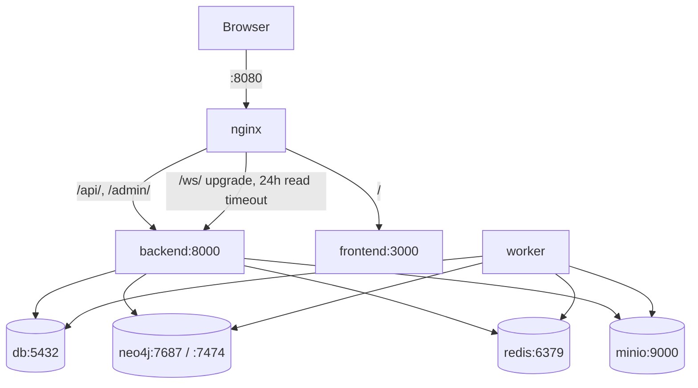

# Infrastructure — Containers, Proxy, Network

Single file: `docker-compose.yml`. One command: `docker compose up --build`.
Eight services, five named volumes.

## Services

| Service | Image / build | Why it's there | Talks to |
|---|---|---|---|
| `db` | **Built** `./infra/postgres`: `postgis/postgis:16-3.4` + vendored pgvector `.debs` installed offline with `dpkg` (a 41 MB apt chain is flaky on slow links; see `debs/SOURCES.txt`) | System-of-record Postgres **plus** PostGIS (geo-ready) and pgvector 0.8.6 (RAG) in one engine | backend, worker |
| `neo4j` | `neo4j:5.21-community`, `NEO4J_PLUGINS=["apoc","graph-data-science"]` (measured live: GDS 2.9.0, APOC 5.21.2) | Temporal graph + GDS analytics + APOC merges | backend, worker |
| `redis` | `redis:7-alpine` | Celery broker/result backend **and** Channels layer (so worker events reach browser sockets across processes) | backend, worker |
| `minio` | `minio/minio:RELEASE.2024-06-06T09-36-42Z`, bucket `evidence` | S3-compatible evidence bytes + report PDFs, presigned-URL downloads | backend |
| `backend` | **Built** `./backend`: `python:3.12-slim` + build-essential/libpq-dev, `pip install -r requirements.txt`, spaCy model download; serves **daphne** (runserver can't do WebSockets): migrate → seed → `daphne -b 0.0.0.0 -p 8000` | The API + WS endpoint | db, neo4j, redis, minio |
| `worker` | Same image; `celery -A config worker` | Off-request AI pipeline | db, neo4j, redis, minio |
| `frontend` | **Built** `./frontend`: `node:20-alpine`, `npm install`, serves **`npm run dev`** (⚠️ demo-grade: dev server, not `next start`) | UI | backend (via nginx), browser |
| `nginx` | `nginx:1.27-alpine`, `:8080` | Single entrypoint: `/api/` + `/admin/` + `/ws/` → backend, `/` → frontend; hardening headers; 100 MB uploads | everything |
| `mock-icjs` | **Built** `./mock-icjs`: `python:3.12-slim` + FastAPI/uvicorn; synthetic case bundles baked in at build time by `generate_cases.py` | Stand-in for the external ICJS case-bundle API. **Internal only** — no host port published, so (like a real government endpoint) only the backend talks to it at `http://mock-icjs:9090` | backend |

## Networking

- Inter-container names (`db`, `neo4j`, `redis`, `minio`, `backend`,
  `frontend`) resolve on the compose network. Nginx deliberately uses
  **no static `upstream` blocks** — `resolver 127.0.0.11` + `set $backend
  …` re-resolves per request, so recreating app containers never leaves
  stale IPs (a real 502 incident during the build taught this).
- Host remaps (local Postgres/Redis often own the defaults):
  Postgres `5433:5432`, Redis `6380:6379`. Containers are unaffected.
  Host-side dev must export `DATABASE_URL=…@localhost:5433/…` and
  `REDIS_URL=…localhost:6380/0` (see [local-dev](../setup/local-dev.md)).
- Healthchecks gate startup: backend waits on `db` healthy
  (`pg_isready`); neo4j has an HTTP check.

## Volumes (what survives `down`)

`pgdata` (all Postgres incl. vectors), `neo4jdata` + `neo4jlogs`,
`redisdata`, `miniodata` (evidence bytes). Code mounts: backend/worker
bind `./backend:/app` (live edits); frontend mounts **source dirs only**
(`app/`, `components/`, `lib/`, `public/`) — never `/app` itself, after a
real incident where a stale anonymous `node_modules` volume shadowed a
dependency update and 500'd the UI.

## Dockerfiles in plain English

- `backend/Dockerfile`: slim Python → C build tools + Postgres client libs
  → pip install the full stack → download `en_core_web_sm` → copy code →
  expose 8000. (~1.4 GB built, mostly spaCy/numpy + reportlab + paddle
  absent by design.)
- `frontend/Dockerfile`: node:20-alpine → `npm install` → copy → expose
  3000, `npm run dev`.
- `infra/postgres/Dockerfile`: PostGIS base → install three vendored debs
  in dependency order (libllvm16 → postgresql-16 upgrade → pgvector) →
  done. No network at build time.
