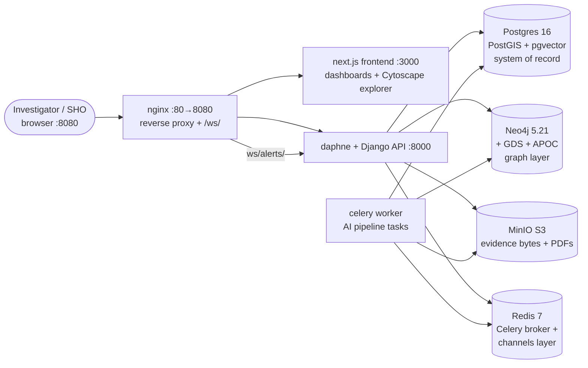

# System Overview

PRAMAAN turns fragmented investigation material (FIR scans, CDR CSVs, bank
notes, witness statements, photos) into a **temporal knowledge graph** of
people, organizations, locations, vehicles, phones, and events — where every
node and edge carries *why* (source evidence), *when* (validity dates),
*how strongly* (confidence), and *by what* (extraction engine).

The non-negotiable design rule, enforced in code: no AI claim reaches the UI
without an evidence trail. See [ai-pipeline](ai-pipeline.md).

## Container map



Direct (host) ports: app `:8080` · frontend `:3000` · API `:8000` ·
Neo4j browser `:7474` / bolt `:7687` · MinIO API `:9000` / console `:9001` ·
Postgres `:5433` (remapped — see [infra](infra.md)) · Redis `:6380` (remapped).

## End-to-end data flow: upload → insight

```mermaid
flowchart TB
    A[Upload: multipart file<br/>POST /api/cases/{id}/evidence/] --> H[SHA-256 hash<br/>uuid storage key<br/>MinIO put_object<br/>ChainOfCustody.UPLOADED]
    H --> Q[process_evidence.delay<br/>Celery + Redis]
    Q --> C[classify_file<br/>heuristics: content markers →<br/>filename → extension]
    Q --> O[run_ocr<br/>raw-text / pypdf-text /<br/>PaddleOCR if installed]
    Q --> N1[extract_entities<br/>regex phones/plates +<br/>spaCy NER + name fallback]
    Q --> N2[extract_relations<br/>sentence patterns +<br/>date parsing]
    Q --> R1[resolve_entities<br/>blocking + scored<br/>merge suggestions]
    Q --> I[index_evidence<br/>chunk ~800 chars +<br/>embed if key set]
    N1 & N2 --> RV[(Postgres review queue<br/>PENDING rows)]
    RV -->|investigator confirm/reject<br/>SHO approves merges| CF[confirmed rows]
    CF --> GB[build_temporal_graph<br/>MERGE into Neo4j +<br/>anomaly/risk alert fan-out]
    GB --> G[(Neo4j temporal graph<br/>every edge: source_evidence_id<br/>confidence, extracted_by/on<br/>valid_from)]
    G --> V[Cytoscape explorer<br/>filters, expand, snapshots<br/>timeline, replay]
    G --> AN[GDS: degree, PageRank<br/>betweenness, WCC, Louvain<br/>→ bridges, risk, anomalies]
    RV --> CP[RAG copilot<br/>path QA + summaries +<br/>hybrid retrieval answers]
```

Stage details: [ai-pipeline](ai-pipeline.md). Storage split: [../data-model/postgres-schema.md](../data-model/postgres-schema.md)
vs [../data-model/neo4j-schema.md](../data-model/neo4j-schema.md).

## Process topology (why two Python processes)

- **backend (daphne)**: serves HTTP API *and* the `ws/alerts/` WebSocket
  channel. Django's `runserver` cannot do WebSockets, which is why the
  container runs daphne (`config.asgi:application`).
- **worker (celery)**: runs the AI pipeline off-request so uploads return
  fast. Both processes share Postgres, Neo4j, MinIO, and Redis; the Redis
  channel layer is what lets worker-side events reach browser sockets.

Details per layer: [backend](backend.md) · [frontend](frontend.md) ·
[graph-layer](graph-layer.md) · [infra](infra.md).
