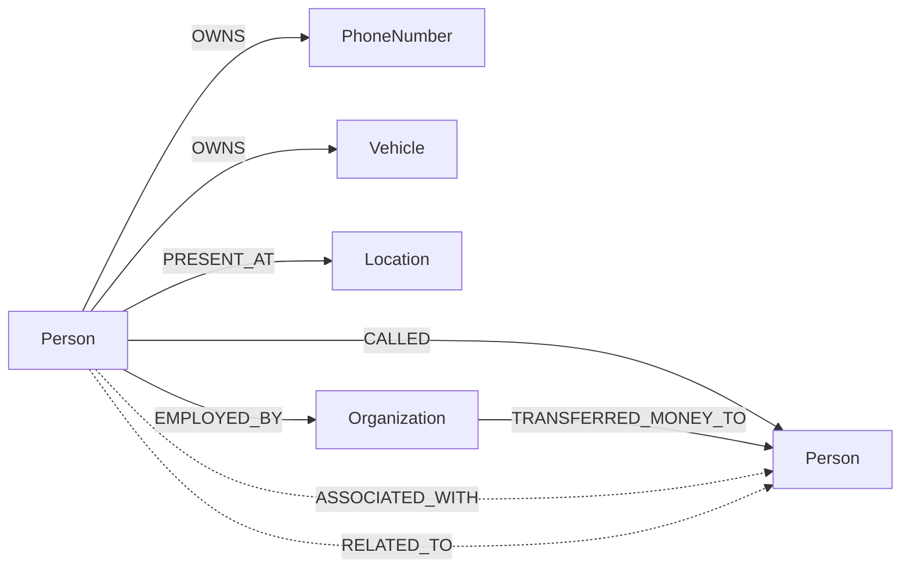

# Neo4j Schema — What's Actually in the Graph

Neo4j 5.21 Community holds **confirmed knowledge only**: rows reach it
exclusively through `build_temporal_graph` (confirmed review rows) and
SHO-approved merges. Pending/rejected rows never leave Postgres. Full
method reference: [graph-layer](../architecture/graph-layer.md).

## Node labels and identity

Every node: `:Case` + one type label. Key = `{case_id}:{Type}:{normalized}`
(e.g. `1:Person:rahul sharma`) — same person in two cases = two nodes.

Types written by the pipeline: `Person`, `Organization`, `Location`,
`Vehicle`, `PhoneNumber`. (`Event` is declared but never created;
`MET_AT` is declared but never emitted — see stubs below.)

## Properties on every node

`key`, `case_id`, `node_type`, `value`, `normalized`,
`confidence_score`, `source_evidence_id`, `extracted_by`
(`pipeline` | `review-confirm:{engine}` | `merge`), `extracted_on` (ISO),
`valid_from`, `valid_to` (accepted, ⚠️ never populated).

## Properties on every edge

Same provenance block **plus `snippet`** (the evidence sentence). Edge id
in API payloads is composite: `{src}->{TYPE}->{dst}`.

## GDS usage (all in `analytics/services/gds.py`)

Per-case Cypher projection → `degree` (undirected), `pageRank`
(confidence-weighted), directed `betweenness`, `wcc` + `louvain`
communities → projection dropped in `finally`. Merges use APOC
`mergeNodes(combine, mergeRels)` + explicit scalar SET (see graph-layer).

## Why two databases

| Lives in Postgres | Lives in Neo4j | Why the split |
|---|---|---|
| Users, cases, assignments, evidence metadata, custody, chunks+vectors, review queue (pending/rejected/merged states), snapshots, alerts, reports, audit, workflow | Confirmed entities + typed, dated, evidence-linked relationships | Review state machines, RBAC filtering, trigram/full-text/vector search, and audit need relational semantics; multi-hop traversal, centrality, communities, and shortest-path QA need a graph engine. The `graph_key` column is the join between them. |

## ⚠️ Stub surface

- `GraphService.snapshot()/diff()` return canned dicts; real snapshots are
  Postgres rows (`GraphSnapshot`). `what_if()` returns `"not-computed"` and
  is unrouted. `Event` nodes, `MET_AT` edges, and `valid_to` are schema
  without producers.
