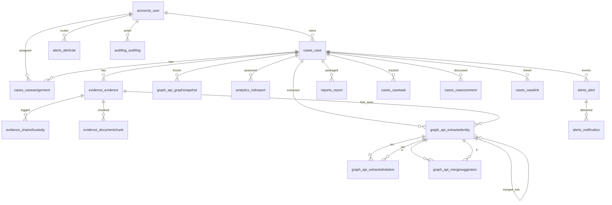

# Postgres Schema — Table by Table

Generated from `apps/*/models.py` + migrations (19 migration files; Django
default table names `app_label_model`). Postgres 16 is the system of record
for everything except the graph itself — see [neo4j-schema](neo4j-schema.md)
for the split rationale.

## accounts — `accounts_user`
Extends `AbstractUser`: `role` (sho/investigator/admin), `phone`,
`totp_secret`, `totp_enabled`. (Migration `0002_user_totp_enabled`.)

## cases — `cases_case`, `cases_caseassignment`, `cases_casetask`, `cases_casecomment`, `cases_caselink`
- **case**: `fir_no` unique+indexed, title, description, status
  (open/under_investigation/pending_review/closed/archived), `risk_level`
  free text (default `"low"` — set by seed/computation, no choices
  enforced), station, district, `owner` FK PROTECT, timestamps.
- **caseassignment**: (case, user) unique; permission view/edit/admin;
  `assigned_by` SET_NULL.
- **casetask**: case CASCADE; title, description, assignee/created_by
  SET_NULL; status todo/doing/done; due_date nullable.
- **casecomment**: case CASCADE; author SET_NULL; text; created ascending.
- **caselink**: from/to case CASCADE; reason; unique (from, to) — reverse
  duplicates rejected in the view, not the constraint.

## evidence — `evidence_evidence`, `evidence_chainofcustody`, `evidence_documentchunk`
- **evidence**: case CASCADE; file_name/type/mime/size; `sha256` indexed;
  `storage_key`; uploaded_by SET_NULL; classification + confidence;
  `ocr_status`, `ocr_text`, `ocr_pages`, `ocr_engine`; `processing_error`;
  index `(case, -created_at)`. (Migrations 0001→0004.)
- **chainofcustody**: evidence **SET_NULL** (trail survives deletion);
  `evidence_snapshot` JSON (file_name/sha256/case); actor SET_NULL;
  action (7 values); details JSON; ip; index (evidence, timestamp).
- **documentchunk**: evidence CASCADE; **denormalized case** CASCADE (access
  filtering without joins); chunk_index; text; `embedding`
  `VectorField(768, null)`; unique (evidence, chunk_index). Migration 0003
  runs `CREATE EXTENSION IF NOT EXISTS vector/pg_trgm` first.

## graph_api — review queue + snapshots
- **extractedentity**: case CASCADE; evidence SET_NULL (first-seen);
  node_type (6 choices incl. unused `Event`); value; normalized (indexed);
  confidence; engine; status pending/confirmed/rejected/merged;
  mention_count; `merged_into` self-FK; `graph_key`; latitude/longitude/
  geo_source; unique (case, type, normalized); index (case, status).
- **extractedrelation**: case CASCADE; evidence SET_NULL; src/dst CASCADE
  to entities; edge_type free text; confidence; `snippet`; engine;
  `valid_from` date nullable (NULL = undated); status; unique
  (case, src, dst, type); index (case, status).
- **mergesuggestion**: case CASCADE; entity_a/b CASCADE; score; reason;
  pending/approved/rejected; decided_by/at; unique (case, a, b).
- **graphsnapshot**: case CASCADE; label; created_by SET_NULL; filters JSON;
  `data` JSON (`{nodes, edges}`); node/edge counts. (Migrations
  0001→0004.)

## analytics / copilot(search has none) / alerts / reports / auditlog
- **analytics_riskreport**: case CASCADE; created_by SET_NULL;
  `weights_version` ("v1"); `scores` JSON (full factor breakdown);
  node_count.
- **alerts_alert**: case CASCADE nullable; kind/severity free text;
  message ≤512; `refs` JSON; `dedupe_key` indexed. (0001→0003: dropped
  `is_read` — read state moved to Notification.)
- **alerts_alertrule**: user CASCADE; kind (`any` default); case nullable
  (null = all visible); min_severity; min_confidence; email_digest;
  enabled. Index (user, read, -created_at) lives on Notification.
- **alerts_notification**: user CASCADE; alert CASCADE; channel
  inapp/email_mock; read bool.
- **reports_report**: case CASCADE; kind (only `evidence_package`);
  storage_key; sha256; size; created_by SET_NULL.
- **auditlog_auditlog**: actor SET_NULL; action; `object_type` = request
  path; `object_id` = `""` always; `before` = `{}` always; `after` =
  `{status}`; timestamp indexed; ip. (Honesty: coarser than the "before/
  after state" docstring claims.)

## Extensions enabled (migration SQL)
`vector` 0.8.6, `pg_trgm` 1.6 (+ PostGIS 3.4.3 present, unused by any
query today — installed for the Phase 7 geo roadmap; geo math is
Python-side).
